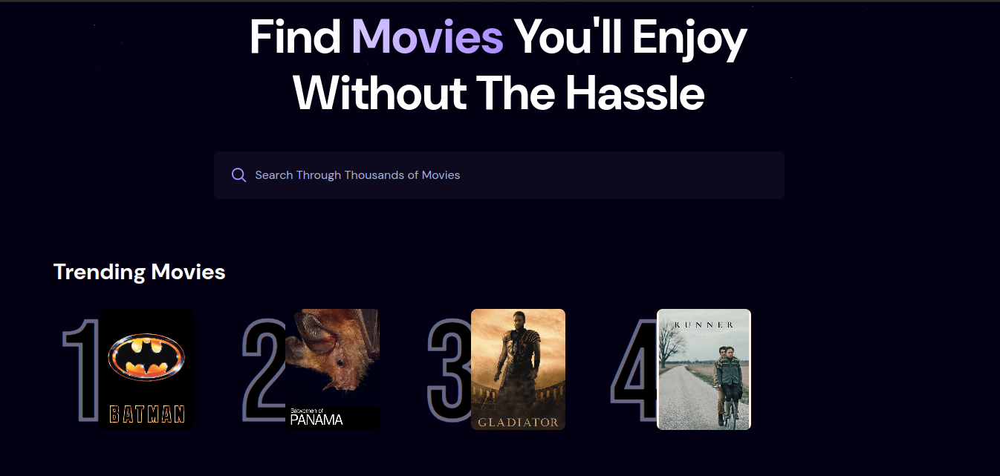
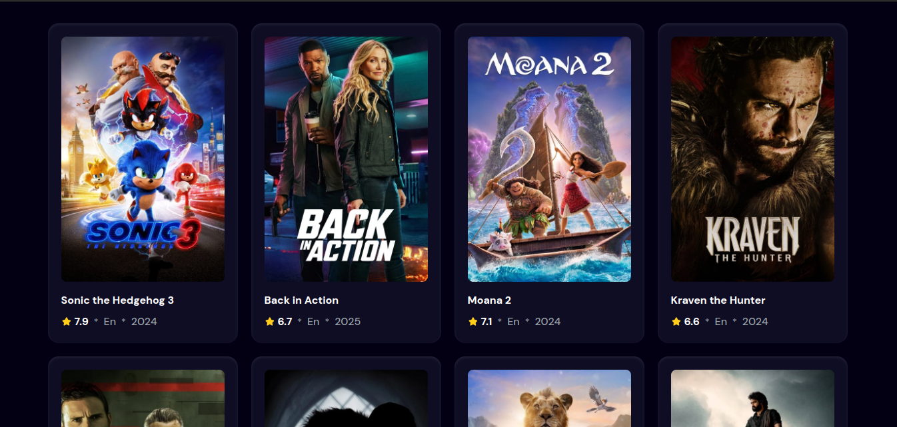

# Movie Search Application

A responsive movie search application built with React.js, Tailwind CSS, and Appwrite. This app allows users to search for movies and see trending movies based on the number of searches. The more often a movie is searched, the higher its ranking in the trending section.

### Features
- Search for movies.
- View trending movies based on search frequency.
- Fully responsive design for mobile and desktop.
- Integrated with Appwrite for back-end services (e.g., saving search counts).

### Tech Stack
- **Frontend**: React.js, Tailwind CSS
- **Backend**: Appwrite (used to store search counts)
- **Deployment**: Vercel

### Demo

Here are some screenshots of the app in action:


*Hero Section Page*


*Trending Movies Page*


*Movies Section*


### Installation

To run this project locally, follow these steps:

1. Clone the repository:
   ```bash
   git clone <repo-url>
   cd <project-directory>
